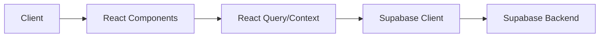

# Pet Pathways Platform Documentation

## Overview

Pet Pathways is a comprehensive platform connecting pet owners with professional pet care service providers. This documentation covers everything from development setup to deployment procedures.

## Table of Contents

1. [Getting Started](#getting-started)
2. [Architecture](#architecture)
3. [Components](#components)
4. [API Reference](#api-reference)
5. [Deployment](#deployment)
6. [Contributing](#contributing)

## Getting Started

### Prerequisites

- Node.js 20+
- npm 9+
- Supabase account

### Installation

```bash
# Install dependencies
npm install

# Start development server
npm run dev

# Run tests
npm test

# Build for production
npm run build
```

### Environment Variables

Copy `.env.example` to `.env` and configure:

```env
VITE_SUPABASE_URL=your-project-url
VITE_SUPABASE_ANON_KEY=your-anon-key
VITE_STRIPE_PUBLISHABLE_KEY=your-publishable-key
```

## Architecture

### Tech Stack

- **Frontend**: React 18 with TypeScript
- **State Management**: React Query & Context API
- **Styling**: Tailwind CSS
- **Database**: Supabase (PostgreSQL)
- **Real-time**: Supabase Realtime
- **Payments**: Stripe
- **Testing**: Vitest & Playwright

### Data Flow



## Components

### Core Components

#### AuthProvider

Manages authentication state and user sessions.

```tsx
import { AuthProvider } from './providers/AuthProvider';

function App() {
  return (
    <AuthProvider>
      <YourApp />
    </AuthProvider>
  );
}
```

#### Calendar

Handles booking and availability management.

```tsx
import { Calendar } from './components/calendar/Calendar';

function BookingPage() {
  return (
    <Calendar
      onEventClick={(eventId) => {}}
      onDateSelect={(start, end) => {}}
      selectable
      editable
    />
  );
}
```

#### ChatWindow

Real-time messaging between clients and providers.

```tsx
import { ChatWindow } from './components/chat/ChatWindow';

function MessagingPage() {
  return (
    <ChatWindow
      participantId="user-123"
      participantName="John Doe"
      participantAvatar="https://example.com/avatar.jpg"
    />
  );
}
```

### UI Components

All UI components are built with accessibility in mind and follow WAI-ARIA guidelines.

#### Button

```tsx
import { Button } from './components/ui/Button';

<Button
  variant="default" // 'default' | 'outline' | 'ghost'
  size="md" // 'sm' | 'md' | 'lg'
  disabled={false}
  onClick={() => {}}
>
  Click Me
</Button>
```

#### Toast

```tsx
import { Toast } from './components/ui/Toast';

<Toast
  type="success" // 'success' | 'error' | 'info'
  message="Operation successful!"
  onClose={() => {}}
/>
```

## API Reference

### Authentication

#### Sign Up

```typescript
const { data, error } = await supabase.auth.signUp({
  email: 'user@example.com',
  password: 'password123',
  options: {
    data: {
      role: 'client'
    }
  }
});
```

#### Sign In

```typescript
const { data, error } = await supabase.auth.signInWithPassword({
  email: 'user@example.com',
  password: 'password123'
});
```

### Bookings

#### Create Booking

```typescript
const { data, error } = await supabase
  .from('bookings')
  .insert({
    client_id: 'user-123',
    provider_id: 'provider-456',
    service_type: 'Dog Walking',
    start_time: '2024-03-01T10:00:00Z',
    end_time: '2024-03-01T11:00:00Z',
    status: 'pending'
  });
```

#### Get Bookings

```typescript
const { data, error } = await supabase
  .from('bookings')
  .select(`
    *,
    client:profiles!client_id(*),
    provider:profiles!provider_id(*),
    payment:payments(amount, status)
  `)
  .eq('client_id', userId)
  .order('start_time', { ascending: false });
```

## Deployment

### Production Deployment

1. Build the application:
```bash
npm run build
```

2. Test the production build:
```bash
npm run preview
```

3. Deploy to Netlify:
```bash
# Ensure environment variables are configured in Netlify dashboard
git push origin main # Netlify will automatically deploy
```

### Environment-Specific Configuration

#### Development
- Uses local environment variables
- Real-time updates enabled
- Debug logging enabled

#### Staging
- Uses staging database
- Test payment gateway
- Error monitoring enabled

#### Production
- Uses production database
- Live payment gateway
- Full monitoring and analytics
- Performance optimization enabled

### Monitoring

The application uses multiple monitoring solutions:

1. Error Monitoring
```typescript
await errorMonitor.logError({
  operation: 'booking.create',
  error: error.message,
  severity: 'high',
  timestamp: new Date().toISOString(),
  context: { bookingId }
});
```

2. Performance Metrics
```typescript
metricsCollector.recordEvent({
  type: 'realtime_event',
  subtype: 'connection',
  success: true,
  duration: endTime - startTime,
  metadata: { userId }
});
```

## Contributing

### Code Style

- Follow the ESLint configuration
- Use TypeScript strict mode
- Write unit tests for new features
- Follow the commit message convention:
  ```
  feat: add new feature
  fix: bug fix
  docs: update documentation
  style: formatting changes
  refactor: code restructuring
  test: add/update tests
  chore: maintenance tasks
  ```

### Pull Request Process

1. Create a feature branch
2. Update documentation
3. Add/update tests
4. Submit PR with description
5. Wait for CI checks
6. Get code review
7. Merge after approval

### Testing

Run different test suites:

```bash
# Unit tests
npm run test

# E2E tests
npm run test:e2e

# Test coverage
npm run test:coverage
```

### Troubleshooting

Common issues and solutions:

1. Real-time connection issues:
   - Check Supabase connection
   - Verify WebSocket support
   - Check network connectivity

2. Payment processing errors:
   - Verify Stripe configuration
   - Check payment intent status
   - Validate amount format

3. Authentication issues:
   - Clear local storage
   - Check token expiration
   - Verify user permissions